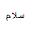
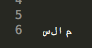
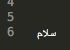

Bidirectional text support for Sublime Text 3
===================

Currently Sublime Text 3 is not supporting bidirectional languages like Arabic, Hebrew etc.. Using this plugin you can view bidirectional texts.

Please note, I don't know Arabic or Hebrew. I have checked the results by pattern matching. Its a starting point. 

Install
-----------------
Clone it into Sublime Package directory.

Set Font face to any Arabic supporting font (Arial) in user settings.  
  

Usage
----------------------
Open file.
Enter text
Tools > Bidirectional text (ctrl+b)

Command Accebility 
-------------------
Tools > Bidirectional text
Ctrl + B
Right click > Bidirectional text

How does this work?
-------------------

This tool takes a similar approach as to tools like [python-bidi](https://github.com/MeirKriheli/python-bidi), [python-arabic-reshaper](https://github.com/mpcabd/python-arabic-reshaper), [Better-Arabic-Reshaper](https://github.com/agawish/Better-Arabic-Reshaper/) and others.
It does not make Sublime Text fully support bidirectional text.
Rather, it uses a clever hack to make the text in the Arabic family of languages look acceptable.

Take the word سلام, for instance, made of the these Unicode code-points in the order that they are typed and stored on disk:

- `U+0633 ARABIC LETTER SEEN`
- `U+0644 ARABIC LETTER LAM`
- `U+0627 ARABIC LETTER ALEF`
- `U+0645 ARABIC LETTER MEEM`

These letters should be displayed right-to-left visually, and the letters should change shape depending on their position as expected in Arabic, like in this image:

Instead, Sublime Text 3 displays the letters left-to-right visually (which is the wrong order), and the letters are incorrectly disconnected:

When you run this plugin with the selected text, it transforms the text into these Unicode code points in this order:

- `U+FEE1 ARABIC LETTER MEEM ISOLATED FORM`
- `U+FEFC ARABIC LIGATURE LAM WITH ALEF FINAL FORM`
- `U+FEB3 ARABIC LETTER SEEN INITIAL FORM`

These Unicode code-points are different from the original ones, because they specify exactly in which inflexible form each letter should be displayed (and the two letters *lam* and *alef* have been converted into one code point).
The order as well as changed, now the letter that is the right-most is first, rather then the letter that is read the first.

The effect is that the Arabic text now looks pretty in editors with poor bidi support like Sublime Text, like in this image:

However, you will still have issues if you try to edit the text.

Bug tracker
----------
Post an issue here on Github. 
https://github.com/praveenvijayan/Sublime-Text-2-BIDI/issues

Resources
----------
http://www.decodize.com/html/sublime-text-2-bidirectional-language-support-plugin/

Twitter 
------------------
Follow for updates :  <a href="http://twitter.com/praveen_vijaya">@praveen_vijaya</a>

Thanks
----
https://github.com/MeirKriheli/python-bidi  
https://github.com/mpcabd/python-arabic-reshaper

